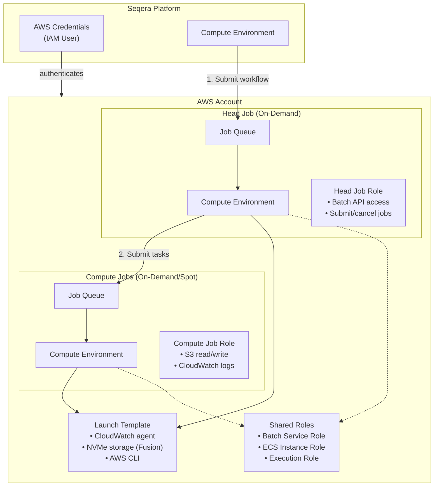

# AWS Batch Manual Configuration for Seqera Platform

## Motivation

AWS Batch compute environments for Nextflow are complex and require many interconnected components: IAM roles, policies, compute environments, job queues, and launch templates. The official documentation covers each piece, but understanding how they all fit together can be challenging.

This Terraform module provides a complete, working implementation that you can study, adapt, and use as a reference for your own infrastructure. It is based on the official [Seqera documentation](https://docs.seqera.io/platform-cloud/enterprise/advanced-topics/manual-aws-batch-setup) but comes in an infastructure-as-code format for easier deployment and version control.

> [!WARNING]
> This is an example implementation only and comes with no warranty or support.

## Introduction

This Terraform module creates AWS Batch compute environments for Seqera Platform **without** using Batch Forge. All AWS resources are created explicitly via Terraform using the AWS and Seqera providers.

When you use Batch Forge (the default in Seqera Platform), the platform automatically creates and manages AWS resources for you. In general, we recommend using Batch Forge wherever possible. However, this manual approach gives you full control over the infrastructure, which may be necessary when you are following strict requirements.

## Overview

A Nextflow compute environment in Seqera Platform requires several AWS components working together. This section explains each component and its purpose.

### Architecture Diagram



### IAM Roles

This module creates several IAM roles, each serving a specific purpose in the Nextflow execution model:

| Role | Purpose | Assumed By |
|------|---------|------------|
| **Batch Service Role** | Allows AWS Batch to manage EC2 instances, create ECS clusters, and orchestrate job scheduling | AWS Batch service |
| **ECS Instance Role** | Allows EC2 instances to register with ECS, pull containers, write logs, and access S3 | EC2 instances in compute environment |
| **Batch Execution Role** | Allows ECS to pull container images from registries and write CloudWatch logs | ECS task execution |
| **Head Job Role** | Allows the Nextflow head job to submit/cancel Batch jobs, register job definitions, and access secrets | nf-launcher container |
| **Compute Job Role** | Allows Nextflow task containers to read/write S3 and write logs | Workflow task containers |
| **Spot Fleet Role** | Allows EC2 Spot Fleet to request and manage Spot instances (only when Spot enabled) | EC2 Spot Fleet |

### IAM Policies

| Policy | Purpose | Attached To |
|--------|---------|-------------|
| **Batch Job Policy** | S3 bucket access (read/write) and CloudWatch logs | ECS Instance Role, Compute Job Role |
| **Head Job Policy** | Batch API access, ECS/EC2 describe, Secrets Manager, PassRole for execution role | Head Job Role |
| **Seqera PassRole Policy** | Allows passing job roles to Batch when creating job definitions | Seqera IAM User |

### AWS Batch Resources

| Resource | Purpose |
|----------|---------|
| **Head Compute Environment** | On-Demand EC2 instances for running the Nextflow head job (nf-launcher) |
| **Compute Environment** | On-Demand or Spot EC2 instances for running workflow tasks |
| **Head Job Queue** | Queue where head jobs are submitted, linked to head CE |
| **Compute Job Queue** | Queue where task jobs are submitted, linked to compute CE |

### Other AWS Resources

| Resource | Purpose |
|----------|---------|
| **Launch Template** | EC2 instance configuration: CloudWatch agent, NVMe storage mounting, AWS CLI |
| **IAM User** | Programmatic access for Seqera Platform (access key stored in Platform) |
| **Instance Profile** | Attaches ECS Instance Role to EC2 instances |

### Seqera Platform Resources

| Resource | Purpose |
|----------|---------|
| **AWS Credentials** | Stores IAM user access keys for Seqera to interact with AWS |
| **Compute Environment** | Configuration that references the manually-created AWS Batch queues |

The key to manual mode is specifying `head_queue` and `compute_queue` **without** a `forge` block in the Seqera compute environment configuration.

## Prerequisites

Before using this module, you need:

1. **AWS Account** with permissions to create:
   - IAM roles, policies, and users
   - AWS Batch compute environments and job queues
   - EC2 launch templates

2. **VPC with Subnets**
   - Private subnets recommended for security
   - NAT Gateway or VPC endpoints for AWS API access
   - Route to internet for pulling container images

3. **Security Group** allowing:
   - Outbound HTTPS (443) to AWS APIs
   - Outbound to S3 (direct or via VPC endpoint)

4. **S3 Bucket** for Nextflow work directory

5. **Seqera Platform Account** with:
   - Access token (generate from profile settings)
   - Workspace ID (visible in workspace URL or settings)

## Usage

### Required Variables

| Variable | Description |
|----------|-------------|
| `region` | AWS region (must match your VPC and S3 bucket) |
| `name` | Prefix for all resources (lowercase, numbers, hyphens only) |
| `subnet_ids` | List of VPC subnet IDs |
| `security_group_ids` | List of security group IDs |
| `work_bucket_name` | S3 bucket name without `s3://` prefix |
| `seqera_access_token` | Seqera Platform access token |
| `seqera_workspace_id` | Seqera Platform workspace ID (numeric) |

### Optional Variables

| Variable | Default | Description |
|----------|---------|-------------|
| `profile` | `null` | AWS CLI profile name |
| `head_max_vcpus` | `128` | Maximum vCPUs for head compute environment |
| `compute_max_vcpus` | `256` | Maximum vCPUs for compute environment |
| `instance_types` | `["c6id", "m6id", "r6id"]` | EC2 instance types (NVMe recommended for Fusion) |
| `use_spot_instances` | `false` | Use Spot instances for compute jobs |
| `enable_wave` | `false` | Enable Wave container provisioning |
| `enable_fusion` | `false` | Enable Fusion file system for S3 |

### Example terraform.tfvars

```hcl
# AWS Configuration
region  = "eu-west-1"
profile = "my-aws-profile"

# Resource Naming
name = "my-nextflow-batch"

# Networking
subnet_ids = [
  "subnet-abc123",
  "subnet-def456"
]
security_group_ids = ["sg-xyz789"]

# S3
work_bucket_name = "my-nextflow-bucket"

# Seqera Platform
seqera_server_url   = "https://api.cloud.seqera.io"
seqera_workspace_id = 123456789
seqera_access_token = "your-token-here"

# Enable Wave and Fusion for better performance
enable_wave   = true
enable_fusion = true
```

### Running Terraform

```bash
# Initialize providers
terraform init

# Preview changes
terraform plan

# Apply infrastructure
terraform apply

# Clean up when done
terraform destroy
```

For sensitive variables, use environment variables instead of tfvars:

```bash
export TF_VAR_seqera_access_token="your-token"
terraform apply
```

## Testing

After applying the Terraform configuration:

1. Navigate to your Seqera Platform workspace
2. Verify the compute environment shows status **AVAILABLE**
3. Launch a test pipeline (e.g., `nextflow-io/hello`)
4. Monitor the run to confirm jobs are submitted and executed successfully

## Outputs

| Output | Description |
|--------|-------------|
| `seqera_compute_env_id` | Compute environment ID in Seqera Platform |
| `seqera_compute_env_status` | Status (should be "AVAILABLE") |
| `seqera_credentials_id` | Credentials ID in Seqera Platform |
| `work_dir` | Full S3 path for work directory |
| `head_queue_name` | Name of head job queue |
| `compute_queue_name` | Name of compute job queue |
| `head_job_role_arn` | ARN of head job IAM role |
| `compute_job_role_arn` | ARN of compute job IAM role |
| `batch_execution_role_arn` | ARN of Batch execution role |

## Troubleshooting

### PassRole Errors

If you see `not authorized to perform: iam:PassRole`, ensure the Seqera IAM user has the PassRole policy attached for all job roles.

### Compute Environment INVALID

- Verify subnet IDs exist in the specified region
- Check security groups allow outbound HTTPS
- Confirm instance types are valid for the region

### Jobs Stuck in RUNNABLE

- Check EC2 capacity limits in your AWS account
- Verify VPC/subnet has route to ECR and S3
- Review CloudWatch logs for the compute environment

## References

- [Seqera Manual AWS Batch Setup](https://docs.seqera.io/platform/latest/compute-envs/aws-batch)
- [Seqera Terraform Provider](https://registry.terraform.io/providers/seqeralabs/seqera/latest/docs)
- [AWS Batch Terraform Resources](https://registry.terraform.io/providers/hashicorp/aws/latest/docs/resources/batch_compute_environment)

## Disclaimer

This code is provided as an example implementation only. No support, warranty, or guarantee is provided. Use at your own risk and adapt to your specific requirements.

<!-- BEGIN_TF_DOCS -->
## Requirements

| Name | Version |
|------|---------|
| <a name="requirement_terraform"></a> [terraform](#requirement\_terraform) | >= 1.0 |
| <a name="requirement_aws"></a> [aws](#requirement\_aws) | ~> 5.0 |
| <a name="requirement_seqera"></a> [seqera](#requirement\_seqera) | >= 0.1 |

## Providers

| Name | Version |
|------|---------|
| <a name="provider_aws"></a> [aws](#provider\_aws) | 5.100.0 |
| <a name="provider_seqera"></a> [seqera](#provider\_seqera) | 0.26.5 |

## Modules

No modules.

## Resources

| Name | Type |
|------|------|
| [aws_batch_compute_environment.compute](https://registry.terraform.io/providers/hashicorp/aws/latest/docs/resources/batch_compute_environment) | resource |
| [aws_batch_compute_environment.head](https://registry.terraform.io/providers/hashicorp/aws/latest/docs/resources/batch_compute_environment) | resource |
| [aws_batch_job_queue.compute](https://registry.terraform.io/providers/hashicorp/aws/latest/docs/resources/batch_job_queue) | resource |
| [aws_batch_job_queue.head](https://registry.terraform.io/providers/hashicorp/aws/latest/docs/resources/batch_job_queue) | resource |
| [aws_iam_access_key.seqera](https://registry.terraform.io/providers/hashicorp/aws/latest/docs/resources/iam_access_key) | resource |
| [aws_iam_instance_profile.ecs_instance](https://registry.terraform.io/providers/hashicorp/aws/latest/docs/resources/iam_instance_profile) | resource |
| [aws_iam_policy.batch_job](https://registry.terraform.io/providers/hashicorp/aws/latest/docs/resources/iam_policy) | resource |
| [aws_iam_policy.head_job](https://registry.terraform.io/providers/hashicorp/aws/latest/docs/resources/iam_policy) | resource |
| [aws_iam_policy.seqera_pass_role](https://registry.terraform.io/providers/hashicorp/aws/latest/docs/resources/iam_policy) | resource |
| [aws_iam_role.batch_execution](https://registry.terraform.io/providers/hashicorp/aws/latest/docs/resources/iam_role) | resource |
| [aws_iam_role.batch_service](https://registry.terraform.io/providers/hashicorp/aws/latest/docs/resources/iam_role) | resource |
| [aws_iam_role.compute_job](https://registry.terraform.io/providers/hashicorp/aws/latest/docs/resources/iam_role) | resource |
| [aws_iam_role.ecs_instance](https://registry.terraform.io/providers/hashicorp/aws/latest/docs/resources/iam_role) | resource |
| [aws_iam_role.head_job](https://registry.terraform.io/providers/hashicorp/aws/latest/docs/resources/iam_role) | resource |
| [aws_iam_role.spot_fleet](https://registry.terraform.io/providers/hashicorp/aws/latest/docs/resources/iam_role) | resource |
| [aws_iam_role_policy_attachment.batch_execution](https://registry.terraform.io/providers/hashicorp/aws/latest/docs/resources/iam_role_policy_attachment) | resource |
| [aws_iam_role_policy_attachment.batch_execution_ecr](https://registry.terraform.io/providers/hashicorp/aws/latest/docs/resources/iam_role_policy_attachment) | resource |
| [aws_iam_role_policy_attachment.batch_service](https://registry.terraform.io/providers/hashicorp/aws/latest/docs/resources/iam_role_policy_attachment) | resource |
| [aws_iam_role_policy_attachment.compute_job](https://registry.terraform.io/providers/hashicorp/aws/latest/docs/resources/iam_role_policy_attachment) | resource |
| [aws_iam_role_policy_attachment.ecs_instance_batch_job](https://registry.terraform.io/providers/hashicorp/aws/latest/docs/resources/iam_role_policy_attachment) | resource |
| [aws_iam_role_policy_attachment.ecs_instance_cloudwatch](https://registry.terraform.io/providers/hashicorp/aws/latest/docs/resources/iam_role_policy_attachment) | resource |
| [aws_iam_role_policy_attachment.ecs_instance_ecs](https://registry.terraform.io/providers/hashicorp/aws/latest/docs/resources/iam_role_policy_attachment) | resource |
| [aws_iam_role_policy_attachment.head_job_batch](https://registry.terraform.io/providers/hashicorp/aws/latest/docs/resources/iam_role_policy_attachment) | resource |
| [aws_iam_role_policy_attachment.head_job_head](https://registry.terraform.io/providers/hashicorp/aws/latest/docs/resources/iam_role_policy_attachment) | resource |
| [aws_iam_role_policy_attachment.head_job_s3_readonly](https://registry.terraform.io/providers/hashicorp/aws/latest/docs/resources/iam_role_policy_attachment) | resource |
| [aws_iam_role_policy_attachment.spot_fleet](https://registry.terraform.io/providers/hashicorp/aws/latest/docs/resources/iam_role_policy_attachment) | resource |
| [aws_iam_user.seqera](https://registry.terraform.io/providers/hashicorp/aws/latest/docs/resources/iam_user) | resource |
| [aws_iam_user_policy_attachment.seqera_batch_job](https://registry.terraform.io/providers/hashicorp/aws/latest/docs/resources/iam_user_policy_attachment) | resource |
| [aws_iam_user_policy_attachment.seqera_head_job](https://registry.terraform.io/providers/hashicorp/aws/latest/docs/resources/iam_user_policy_attachment) | resource |
| [aws_iam_user_policy_attachment.seqera_pass_role](https://registry.terraform.io/providers/hashicorp/aws/latest/docs/resources/iam_user_policy_attachment) | resource |
| [aws_launch_template.batch](https://registry.terraform.io/providers/hashicorp/aws/latest/docs/resources/launch_template) | resource |
| [seqera_aws_batch_ce.batch](https://registry.terraform.io/providers/seqeralabs/seqera/latest/docs/resources/aws_batch_ce) | resource |
| [seqera_aws_credential.aws_keys](https://registry.terraform.io/providers/seqeralabs/seqera/latest/docs/resources/aws_credential) | resource |

## Inputs

| Name | Description | Type | Default | Required |
|------|-------------|------|---------|:--------:|
| <a name="input_additional_bucket_arns"></a> [additional\_bucket\_arns](#input\_additional\_bucket\_arns) | Additional S3 bucket ARNs that jobs need read/write access to (e.g., for input/output data). | `list(string)` | `[]` | no |
| <a name="input_allocation_strategy"></a> [allocation\_strategy](#input\_allocation\_strategy) | Allocation strategy for compute environment. BEST\_FIT\_PROGRESSIVE recommended for On-Demand, SPOT\_CAPACITY\_OPTIMIZED for Spot. | `string` | `"BEST_FIT_PROGRESSIVE"` | no |
| <a name="input_ami_id"></a> [ami\_id](#input\_ami\_id) | Custom AMI ID for compute instances. Leave null to use AWS Batch default ECS-optimized AMI (recommended). | `string` | `null` | no |
| <a name="input_compute_max_vcpus"></a> [compute\_max\_vcpus](#input\_compute\_max\_vcpus) | Maximum vCPUs for compute job environment. This controls the parallelism of your workflow tasks. | `number` | `256` | no |
| <a name="input_compute_min_vcpus"></a> [compute\_min\_vcpus](#input\_compute\_min\_vcpus) | Minimum vCPUs to maintain for compute job environment. Set to 0 to scale to zero when idle. | `number` | `0` | no |
| <a name="input_ec2_key_pair"></a> [ec2\_key\_pair](#input\_ec2\_key\_pair) | EC2 key pair name for SSH access to compute instances. Leave null to disable SSH access. | `string` | `null` | no |
| <a name="input_enable_fusion"></a> [enable\_fusion](#input\_enable\_fusion) | Enable Fusion file system for improved S3 performance. Requires enable\_wave to be true. | `bool` | `false` | no |
| <a name="input_enable_wave"></a> [enable\_wave](#input\_enable\_wave) | Enable Wave containers for automatic container provisioning. | `bool` | `false` | no |
| <a name="input_head_job_cpus"></a> [head\_job\_cpus](#input\_head\_job\_cpus) | Number of CPUs allocated for the head job. Leave null to use Seqera Platform defaults. | `number` | `null` | no |
| <a name="input_head_job_memory_mb"></a> [head\_job\_memory\_mb](#input\_head\_job\_memory\_mb) | Memory allocation for the head job in MB. Leave null to use Seqera Platform defaults. | `number` | `null` | no |
| <a name="input_head_max_vcpus"></a> [head\_max\_vcpus](#input\_head\_max\_vcpus) | Maximum vCPUs for head job compute environment. Head jobs orchestrate the workflow. | `number` | `128` | no |
| <a name="input_head_min_vcpus"></a> [head\_min\_vcpus](#input\_head\_min\_vcpus) | Minimum vCPUs to maintain for head job compute environment. Set to 0 to scale to zero when idle. | `number` | `0` | no |
| <a name="input_instance_types"></a> [instance\_types](#input\_instance\_types) | EC2 instance types for compute environment. Defaults to instance families with NVMe storage for optimal Nextflow performance. ARM64/Graviton instances are not supported in manual setups. | `list(string)` | <pre>[<br>  "c6id",<br>  "m6id",<br>  "r6id"<br>]</pre> | no |
| <a name="input_name"></a> [name](#input\_name) | Name prefix for all resources. Used in naming convention: {name}-{resource-type} | `string` | n/a | yes |
| <a name="input_nextflow_config"></a> [nextflow\_config](#input\_nextflow\_config) | Additional Nextflow configuration to append to the compute environment. Use heredoc syntax for multi-line config. | `string` | `null` | no |
| <a name="input_post_run_script"></a> [post\_run\_script](#input\_post\_run\_script) | Bash script to run after workflow execution. Use for cleanup, archiving results, notifications, etc. | `string` | `null` | no |
| <a name="input_pre_run_script"></a> [pre\_run\_script](#input\_pre\_run\_script) | Bash script to run before workflow execution. Use for environment setup, loading modules, etc. | `string` | `null` | no |
| <a name="input_profile"></a> [profile](#input\_profile) | AWS CLI profile to use for authentication. Leave null to use default credentials. | `string` | `null` | no |
| <a name="input_region"></a> [region](#input\_region) | AWS region where resources will be created. Should match the region of your VPC and S3 bucket. | `string` | n/a | yes |
| <a name="input_security_group_ids"></a> [security\_group\_ids](#input\_security\_group\_ids) | List of security group IDs to attach to compute instances. Must allow outbound HTTPS (443) for AWS API calls. | `list(string)` | n/a | yes |
| <a name="input_seqera_access_token"></a> [seqera\_access\_token](#input\_seqera\_access\_token) | Seqera Platform access token for authentication. | `string` | n/a | yes |
| <a name="input_seqera_compute_env_description"></a> [seqera\_compute\_env\_description](#input\_seqera\_compute\_env\_description) | Description for the compute environment in Seqera Platform. | `string` | `null` | no |
| <a name="input_seqera_compute_env_name"></a> [seqera\_compute\_env\_name](#input\_seqera\_compute\_env\_name) | Name for compute environment in Seqera Platform. Defaults to var.name. | `string` | `null` | no |
| <a name="input_seqera_credentials_name"></a> [seqera\_credentials\_name](#input\_seqera\_credentials\_name) | Name for AWS credentials in Seqera Platform. Defaults to '{name}-aws-credentials'. | `string` | `null` | no |
| <a name="input_seqera_server_url"></a> [seqera\_server\_url](#input\_seqera\_server\_url) | Seqera Platform API server URL. | `string` | `"https://api.cloud.seqera.io"` | no |
| <a name="input_seqera_workspace_id"></a> [seqera\_workspace\_id](#input\_seqera\_workspace\_id) | Seqera Platform workspace ID where the compute environment will be created. | `number` | n/a | yes |
| <a name="input_spot_bid_percentage"></a> [spot\_bid\_percentage](#input\_spot\_bid\_percentage) | Maximum Spot price as percentage of On-Demand price (1-100). Only used when use\_spot\_instances=true. Leave at 100 to pay market price. | `number` | `100` | no |
| <a name="input_subnet_ids"></a> [subnet\_ids](#input\_subnet\_ids) | List of subnet IDs for compute instances. Use private subnets for security. Multiple subnets recommended for high availability. | `list(string)` | n/a | yes |
| <a name="input_tags"></a> [tags](#input\_tags) | Tags to apply to all AWS resources created by this module. | `map(string)` | `{}` | no |
| <a name="input_use_spot_instances"></a> [use\_spot\_instances](#input\_use\_spot\_instances) | Whether to use Spot instances for compute jobs. Spot instances can reduce costs by up to 90% but may be interrupted. Head jobs always use On-Demand. | `bool` | `false` | no |
| <a name="input_work_bucket_name"></a> [work\_bucket\_name](#input\_work\_bucket\_name) | S3 bucket name for Nextflow work directory (without s3:// prefix). This bucket stores intermediate workflow files. | `string` | n/a | yes |
| <a name="input_work_dir_path"></a> [work\_dir\_path](#input\_work\_dir\_path) | Path within work bucket for Nextflow work directory. Full path will be s3://{work\_bucket\_name}/{work\_dir\_path} | `string` | `"work"` | no |

## Outputs

| Name | Description |
|------|-------------|
| <a name="output_batch_execution_role_arn"></a> [batch\_execution\_role\_arn](#output\_batch\_execution\_role\_arn) | ARN of the Batch execution role |
| <a name="output_batch_service_role_arn"></a> [batch\_service\_role\_arn](#output\_batch\_service\_role\_arn) | ARN of the AWS Batch service role |
| <a name="output_compute_environment_arn"></a> [compute\_environment\_arn](#output\_compute\_environment\_arn) | ARN of the compute job compute environment |
| <a name="output_compute_environment_name"></a> [compute\_environment\_name](#output\_compute\_environment\_name) | Name of the compute job compute environment |
| <a name="output_compute_job_role_arn"></a> [compute\_job\_role\_arn](#output\_compute\_job\_role\_arn) | ARN of the compute job role |
| <a name="output_compute_queue_arn"></a> [compute\_queue\_arn](#output\_compute\_queue\_arn) | ARN of the compute job queue |
| <a name="output_compute_queue_name"></a> [compute\_queue\_name](#output\_compute\_queue\_name) | Name of the compute job queue |
| <a name="output_ecs_instance_profile_arn"></a> [ecs\_instance\_profile\_arn](#output\_ecs\_instance\_profile\_arn) | ARN of the ECS instance profile |
| <a name="output_ecs_instance_role_arn"></a> [ecs\_instance\_role\_arn](#output\_ecs\_instance\_role\_arn) | ARN of the ECS instance role |
| <a name="output_head_compute_environment_arn"></a> [head\_compute\_environment\_arn](#output\_head\_compute\_environment\_arn) | ARN of the head job compute environment |
| <a name="output_head_compute_environment_name"></a> [head\_compute\_environment\_name](#output\_head\_compute\_environment\_name) | Name of the head job compute environment |
| <a name="output_head_job_role_arn"></a> [head\_job\_role\_arn](#output\_head\_job\_role\_arn) | ARN of the head job role |
| <a name="output_head_queue_arn"></a> [head\_queue\_arn](#output\_head\_queue\_arn) | ARN of the head job queue |
| <a name="output_head_queue_name"></a> [head\_queue\_name](#output\_head\_queue\_name) | Name of the head job queue |
| <a name="output_launch_template_id"></a> [launch\_template\_id](#output\_launch\_template\_id) | ID of the EC2 launch template |
| <a name="output_seqera_compute_env_id"></a> [seqera\_compute\_env\_id](#output\_seqera\_compute\_env\_id) | Seqera Platform compute environment ID |
| <a name="output_seqera_compute_env_status"></a> [seqera\_compute\_env\_status](#output\_seqera\_compute\_env\_status) | Seqera Platform compute environment status |
| <a name="output_seqera_credentials_id"></a> [seqera\_credentials\_id](#output\_seqera\_credentials\_id) | Seqera Platform credentials ID |
| <a name="output_spot_fleet_role_arn"></a> [spot\_fleet\_role\_arn](#output\_spot\_fleet\_role\_arn) | ARN of the Spot Fleet role (null if Spot not enabled) |
| <a name="output_work_dir"></a> [work\_dir](#output\_work\_dir) | S3 work directory path configured for this compute environment |
<!-- END_TF_DOCS -->